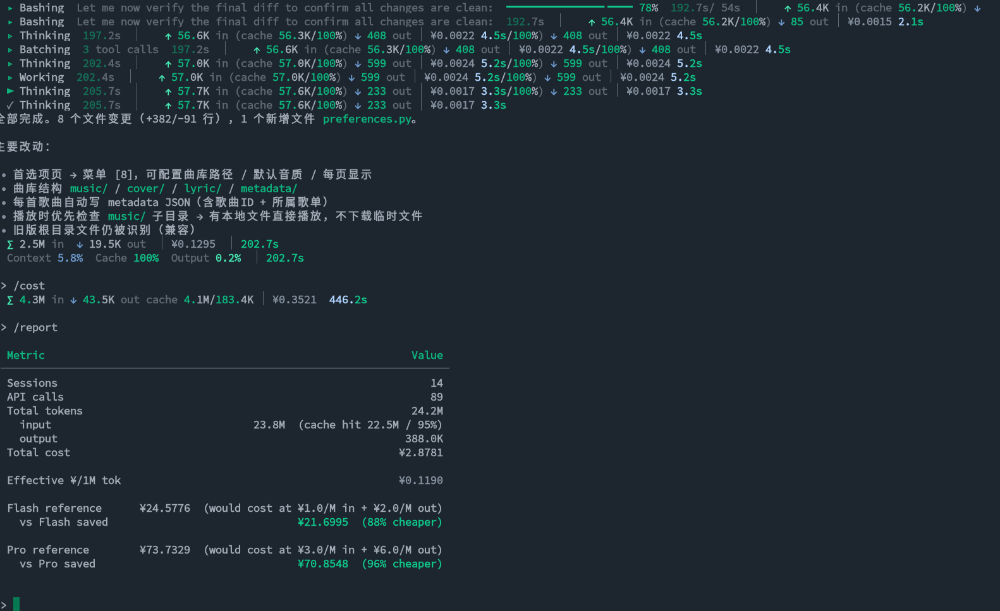

<p align="center">
  
</p>

[简体中文](README_zh.md)

**Token-efficient AI coding agent for your terminal.**

Dekacode runs in your terminal as an AI software engineering assistant. It understands natural language instructions and autonomously performs file operations, shell commands, code analysis, and symbol navigation — all through LLM tool-calling. Every architectural decision targets **token efficiency**: minimal context, aggressive caching, speculative pre-fetching, and smart model routing.



```
∑ 2.5M in  ↓ 19.5K out  │ ¥0.1295  │ 202.7s
Context 5.8%  Cache 100%  Output 0.2%  │ 202.7s
```

🧮 **Cost Verification**

| Item | Calculation | Value |
|------|------------|-------|
| Output cost | 19.5K × ¥2/1M | ¥0.039 |
| Actual input cost | ¥0.1295 − ¥0.039 | ¥0.0905 |
| Implied input unit price | ¥0.0905 ÷ 2.5M | **¥0.036/1M** |

This proves: as long as the request is large enough (>2M tokens) and the prefix achieves 100% cache hit, DeepSeek-V4-Flash (and other cache-supporting models) enters a **"marginal cost approaches zero"** ultra-economic zone. For bulk code analysis tasks, merging them into a single large request is far more cost-effective than splitting them into multiple smaller ones.

---

## Features

- **Tool-calling agent** — 20+ built-in tools: read/write files, execute bash, glob, grep, fetch URLs, search symbols, check Python syntax, diff files, edit code, and more
- **AST call graph** — full-project symbol index with caller/callee chain traversal; 140+ symbols indexed in ~0.01s
- **Token-first architecture**
  - Append-only context loop + fixed prefix → maximizes DeepSeek V4 prefix cache hits (cost as low as ¥0.025/1M tokens)
  - Speculative pre-fetch: extracts undefined symbols from error output and auto-injects source code
  - `[FETCH:Class:Name]` placeholder protocol — model requests symbol definitions on demand
  - RTK output filters: strips ANSI codes, timestamps, UUIDs from bash/grep output (reduces tool output 60–90%)
- **Dual-model routing** — Flash (cheap) for simple tasks, Pro (powerful) for complex ones; auto-downgrade during peak hours
- **Extended analysis toolkit** — batch execution, symbol location, code diagnosis, project summarization, dependency mapping, snapshots, incremental git analysis
- **Rich terminal UI** — Markdown rendering, syntax highlighting, live status spinner with per-operation timing and progress bar
- **Session persistence** — SQLite-backed conversation history with `/resume` to restore previous sessions
- **Modular prompts** — YAML front-matter fragments (`enabled: true/false`, `order:`) for flexible system prompt composition
- **File watcher** — detects source changes and incrementally rebuilds the call graph
- **Cost observability** — per-call token/cache/cost tracking with session budget limits
- **Duration predictor** — OLS-based request latency prediction for smarter progress display
- **Cache warmer** — keepalive requests during idle to prevent server-side prefix cache eviction
- **Provider-agnostic** — works with any OpenAI-compatible API: DeepSeek, OpenAI, ZhiPu, LM Studio (local), etc.

---

## Quick Start

### Requirements

- Python 3.12+
- An OpenAI-compatible API endpoint

### Install

```bash
git clone https://github.com/your-org/dekacode.git && cd dekacode
pip install -r requirements.txt
cp .env.example .env   # edit with your API keys
```

Dependencies: `pydantic>=2.0`, `pydantic-settings>=2.0`, `httpx>=0.27`, `prompt_toolkit>=3.0`, `rich>=13.0`

### Configure

```ini
PROVIDER=openai
OPENAI_API_KEY=sk-xxx
OPENAI_BASE_URL=https://api.deepseek.com

FLASH_MODEL=deepseek-v4-flash
PRO_MODEL=deepseek-v4-pro
```

See `.env.example` for all options (dual API keys, provider switching, session limits, etc.).

### Run

```bash
cd /your/project
python /path/to/dekacode/main.py
```

---

## Usage

### Commands

| Command | Description |
|---------|-------------|
| `/cost` | Show session token & cost summary |
| `/stats` | Show context / call graph / model stats |
| `/prompts` | List enabled/disabled prompt fragments |
| `/graph` | Show project symbol map |
| `/sessions` | List saved chat sessions |
| `/resume` | Load the most recent session |
| `/save` | Save current session immediately |
| `/load <id>` | Load a specific session by ID |
| `/retry` | Retry the last input |
| `/undo` | Undo the last turn |
| `/flash` | Switch to flash model (cheap) |
| `/pro` | Switch to pro model (powerful) |
| `/mode` | Auto model selection |
| `/help` | Show all commands |
| `/exit` | Exit |

### Examples

```
 > Show me the architecture of this project
 > Check main.py for syntax errors
 > Find all callers of handle_request
 > Add logging to UserService
 > Summarize the changes in the last 5 commits
 > Generate a module dependency graph
```

---

## Architecture

```
main.py                     Entry point: main loop, command dispatch, tool execution
├── prompt_engine.py        Builds system prompt from prompts/*.md fragments
├── context.py              Three-zone context (prefix / history / draft)
│   └── SpeculativePrefetcher  Auto-resolves undefined symbols from error output
├── skill.py                Skill base class, registry, tool definition generation
├── router.py               Flash/Pro model selection with peak-hour awareness
├── token_counter.py        Token & cost tracking (cache hit/miss, peak multiplier)
├── predictor.py            OLS-based request duration prediction
├── cache_warmer.py         Keepalive requests to maintain prefix cache
├── chat_store.py           SQLite session persistence (messages, usage, predictor state)
├── session_logger.py       Detailed JSON request/response logging
├── status_display.py       Rich terminal status spinner with progress bars
├── config.py               Pydantic-settings config (.env)
├── models.py               Data models: Message, ToolCall, Function, etc.
└── utils.py                LLM HTTP client with retry logic

skills/                     Tool implementations
├── bash.py                 Shell command execution
├── file_ops.py             Read/write/edit/glob/grep/list files
├── git_ops.py              Git diff
├── symbol_search.py        Symbol search, callers, read_symbol
├── py_check.py             Python syntax check & AST summary
├── web_fetch.py            URL content fetching
├── filters.py              RTK output filters (ANSI, timestamp, UUID stripping)
├── dekacode.py             Hub skill — integrates core + project analysis modules
├── core/                   Core analysis tools
│   ├── batch.py            Batch bash & symbol search
│   ├── cache.py            File/result caching
│   ├── chunk.py            Semantic file chunking & smart grep
│   ├── locator.py          find_definition, find_references, all_symbols
│   └── diagnose.py         Error diagnosis, import issue detection
└── project/                Project-level analysis
    ├── incremental.py      Git diff lines, file delta, incremental change graph
    ├── summary.py          File/project/session summarization
    └── snapshot.py         Key file identification, module dependency map, snapshots

code_graph/                 AST-based call graph
├── builder.py              Scans project, builds Symbol index from AST
├── symbol.py               Symbol & CallGraph data structures
├── cache.py                SQLite-backed graph cache with staleness detection
├── search.py               Symbol search, caller/callee chain traversal
├── watcher.py              File modification monitor
├── placeholders.py         [FETCH:] placeholder resolver
└── imports.py              Import -> file path resolver

prompts/                    YAML front-matter prompt fragments
├── system.md               Code Agent identity
├── tools.md                Tool list (injected at runtime)
├── rules.md                Behavior constraints
├── jianyan.md              Ultra-concise speech mode
├── overview.md             Project overview protocol
├── placeholders.md         [FETCH:] protocol instructions
└── terse.md                Token-saving hints (disabled by default)
```

### Data Flow

```
User input → ContextManager (append history)
  → LLMClient.chat() (system + prefix + history + draft)
    → model response (text | tool_calls)
      → tool calls → SkillRegistry.execute()
        → results → ContextManager (append draft)
          → loop until stop
```

---

## Token Economy

| Optimization | Savings |
|---|---|
| Fixed prefix → cache hit | Input cost ↓ 120x |
| Call graph → symbol search | Context ↓ 80%+ |
| Speculative pre-fetch | Round trips ↓ 3–4 |
| Peak-hour auto-downgrade | Cost ↓ 50% |
| RTK output filters | Tool output ↓ 60–90% |
| Duration predictor → accurate ETA | Better UX |

Pricing (DeepSeek V4): Flash ¥2/1M out, Pro ¥6/1M out (peak ×2).

---

## Runtime Directory

```
.dekacode/
├── chat.db               Conversation history (SQLite)
├── codegraph_cache.db    Call graph cache (SQLite)
└── logs/                 Session JSON logs
```

---

## License

MIT
